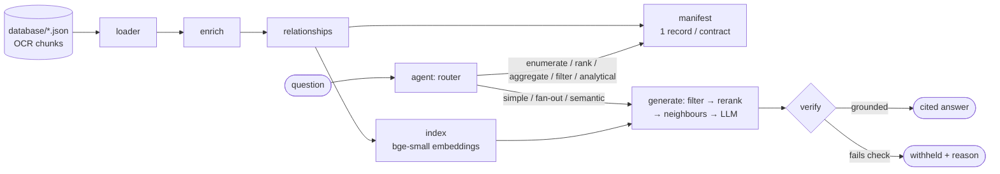

# sentri-backend

> Grounded, cited question answering over Philippine DPWH construction-bid documents — a local,
> CPU-first RAG pipeline with an agentic controller and a streaming (SSE) API.

sentri-backend answers questions about public-works contracts: who bid, who won, for how much, who
signed, and when. The answers come from OCR'd bid documents of the Philippine
[Department of Public Works and Highways (DPWH)](https://www.dpwh.gov.ph/). Every answer is
retrieved from the source documents and cites them. A deterministic verifier checks each answer
**before** it is displayed, and an answer that fails the check is withheld rather than shown. Built on
[LlamaIndex](https://docs.llamaindex.ai/), it runs entirely on the local machine: CPU embeddings
and reranking, plus a small local LLM served by [Ollama](https://ollama.com/). No document ever
leaves the machine.

## Table of Contents

- [Background](#background)
- [Install](#install)
- [Usage](#usage)
- [Architecture](#architecture)
- [Configuration](#configuration)
- [Evaluation](#evaluation)
- [Streaming API](#streaming-api)
- [Limitations](#limitations)
- [Repository layout](#repository-layout)
- [References](#references)
- [License](#license)

## Background

Procurement records are spread across several documents per contract: the invitation to bid, the
BAC resolution, the notice of award, the contract agreement and the notice to proceed. A single fact
can live in a table cell, a signature block or a rubber-stamped date. This project indexes those
documents so that a question like *"Who signed the contract agreement for 24CC0265?"* is answered
from the right chunk of the right document, and says where the answer came from.

The corpus in this repository:

| | |
|---|---|
| Contracts | 6 (`24A00153`, `24AJ0052`, `24BG0272`, `24BJ0005`, `24CC0265`, `24CM0001`) |
| Source PDFs | 31, in [`source/`](source/) |
| OCR transcription | 38 JSON files, in [`database/`](database/) — **the authoritative text** (see [CLAUDE.md](CLAUDE.md)) |
| Chunks | ~400 text / table / image / signature chunks, one index node each ([`rag/loader.py`](rag/loader.py)) |

Design constraints, recorded in [CLAUDE.md](CLAUDE.md):

- **CPU-only and privacy-first.** torch is installed CPU-only by [`scripts/setup.sh`](scripts/setup.sh), and generation runs on a local Ollama server.
- **Models are swappable through config.** They are read from `RAG_*` environment variables in [`rag/config.py`](rag/config.py), so the pipeline can move to stronger hardware without code changes.
- **"Pass" means retrieval recall**, measured by `make eval` against [`eval/eval_retrieval.json`](eval/eval_retrieval.json).

## Install

Prerequisites:

- [conda](https://docs.conda.io/). Everything runs in the `sentri-backend` env ([`scripts/setup.sh`](scripts/setup.sh) creates it with Python 3.13).
- [Ollama](https://ollama.com/) with the default generation model pulled: [`granite4.1:3b`](https://ollama.com/library/granite4.1).

```bash
make setup                                # conda env + pinned deps (requirements.txt), CPU-only torch
ollama pull granite4.1:3b                 # generation model (needs a running `ollama serve`)
make build                                # embed & persist the index + extract the corpus manifest
pip install -r service/requirements.txt   # only for the streaming API (not installed by setup)
```

`make build` needs Ollama. Its final step extracts one manifest record per contract with the LLM,
after the CPU embedding ([`scripts/build.sh`](scripts/build.sh)). The built index lands in
`index_store/`, which is regenerable and gitignored ([`.gitignore`](.gitignore)).

## Usage

Everything runs through `make`. The targets are defined in the [`Makefile`](Makefile) and
documented in [`scripts/README.md`](scripts/README.md).

```bash
make check                                  # stage 1–3 self-checks (loader, enrich, relationships) + router gate; no model
make eval                                   # retrieval recall gate (default mode: rerank)
make ask   Q="Which contractor was awarded contract 24AJ0052?"
make agent Q="Who is the District Engineer for contracts 24BJ0005 and 24CC0265?"
make chat-agentic                           # interactive loop that carries the conversation's contract
make eval-agentic                           # answer-level eval of the agent
make serve                                  # streaming SSE API on :8000
```

All targets except `check`, `coverage` and `eval` need a running Ollama server.

## Architecture

Each pipeline stage is a module in [`rag/`](rag/) that can be run as `python -m rag.<name>`. The
section follows the advice of [ARCHITECTURE.md](https://matklad.github.io/2021/02/06/ARCHITECTURE.md.html):
it maps where things live, not how every function works.



| Stage | Module | What it does |
|---|---|---|
| Load | [`rag/loader.py`](rag/loader.py) | One node per OCR chunk. Context-free chunks (a bare date stamp, a notarial register entry, an agreement's "made this … day of" line) get a label taken from their own page. |
| Enrich | [`rag/enrich.py`](rag/enrich.py) | Contract id and document type as metadata. The embedding stays on pure content. |
| Relationships | [`rag/relationships.py`](rag/relationships.py) | Reading-order previous/next links, so a hit can be expanded to its neighbours. |
| Index | [`rag/index.py`](rag/index.py) | Embeds with [BAAI/bge-small-en-v1.5](https://huggingface.co/BAAI/bge-small-en-v1.5) on CPU and persists to `index_store/`. |
| Manifest | [`rag/manifest.py`](rag/manifest.py) | One structured record per contract, used for "list all projects" questions and as the verifier's oracle. |
| Rerank | [`rag/rerank.py`](rag/rerank.py) | CPU cross-encoder [BAAI/bge-reranker-base](https://huggingface.co/BAAI/bge-reranker-base). It takes 40 candidates, labels each with its document type and contract, and keeps the top 10. |
| Generate | [`rag/generate.py`](rag/generate.py) | Retrieval filtered to the contract, reranked, neighbour-expanded, and trimmed to fit a single `num_ctx` call. The answer cites its sources. |
| Verify | [`rag/verify.py`](rag/verify.py) | Deterministic grounding check against the manifest: flags invented contract ids and mis-bound locations, contractors or people. |
| Agent | [`rag/agent.py`](rag/agent.py) | Routes each question (`simple`, `fanout`, `semantic`, `enumerate`, `rank`, `aggregate`, `filter` or `analytical`) and fans corpus-wide questions out per contract. `rank` ("which contract has the highest amount", optionally "among the contracts above X") sorts the manifest amounts in code, `aggregate` ("the total / average amount of the contracts", optionally "above X") sums them in code, and `filter` ("which / how many contracts have an amount above 100 million") compares each with the threshold in code; no LLM compares or adds numbers. Failed answers retry through a verifier-driven ladder: widen k, then withhold. |
| Subject | [`rag/subject.py`](rag/subject.py) | Carries a conversation's contract into follow-up questions ("who signed *it*?"). |

A calc-cued question about one contract ("the total / combined / difference of ...") routes `calc`:
the answer cites each operand from its chunk, guards check them, and no total is stated. This stops
wrong sums; it does not compute sums. It is safe but strict: through the service it answered 1 of
7 sums from the queries set (0 wrong, no total stated) and withheld the other 6.

An un-cued phrasing (for example "how much does A differ from B") still routes `simple`, and the
model can compute there. A **numeric grounding guard** checks every model-written answer part: a
figure >= 1,000 that no cited source (or the question) holds withholds that part. Measured on a
held-out set: 0 of 11 sealed computed-figure questions leaked a figure, over 3 runs (a true leak
rate below about 27%, rule of three), and 0 of 4 sealed lookup controls were withheld by the
guard. Figures below 1,000 (percents, day counts, small differences) and amounts in words are not
checked, and a held figure is not checked to be the right one.

The **LLM is not trusted with arithmetic**, and the verifier's pass only confirms contract ids, locations and
contractors (plus, on the agent path, the figure rule above). The agent's prompts and [`rag/verify.py`](rag/verify.py) spell out both limits.

## Configuration

Every model and retrieval knob is an environment variable read in [`rag/config.py`](rag/config.py):

| Variable | Default | Meaning |
|---|---|---|
| `RAG_EMBED_PROVIDER` / `RAG_EMBED_MODEL` | `huggingface` / `BAAI/bge-small-en-v1.5` | Embedding backend and model |
| `RAG_RERANK_MODEL` | `BAAI/bge-reranker-base` | Cross-encoder reranker |
| `RAG_RERANK_CANDIDATES` / `RAG_RERANK_TOP_N` | `40` / `10` | Candidates retrieved / kept after reranking |
| `RAG_GEN_MODEL` | `granite4.1:3b` | Ollama generation model |
| `RAG_GEN_TEMPERATURE` / `RAG_GEN_NUM_CTX` | `0.0` / `4096` | Deterministic decoding; context capped to fit a 4 GB GPU |
| `RAG_AGENT_MAX_ATTEMPTS` / `RAG_AGENT_WIDE_TOP_N` | `2` / `20` | Size of the agent's self-correction ladder |
| `RAG_OLLAMA_BASE_URL` / `RAG_PERSIST_DIR` | `http://localhost:11434` / `index_store` | Ollama endpoint / index location |
| `RAG_CONDA_ENV` | `sentri-backend` | Env the `scripts/*.sh` wrappers activate |

## Evaluation

| Suite | Command | Ground truth | Latest result |
|---|---|---|---|
| Retrieval recall (the gate) | `make eval` | [`eval/eval_retrieval.json`](eval/eval_retrieval.json), 40 questions | hit rate **1.000** (single, broad and complex) |
| Agent, answer level | `make eval-agentic` | [`eval/eval_agentic.json`](eval/eval_agentic.json), 89 questions incl. 2 withhold traps, 8 rank, 13 aggregate and 18 filter questions, 40 look-alikes and 1 accepted fall-through (routing only) | **89/89** |
| Full question set through the streaming service | local harness | 441 questions from the local, untracked `docs/queries.txt` | **415/441 = 94.1%** (2026-10-05) |

The one failing agent row is a known model miss. In the 24CM0001 notice to proceed the contractor
appears only as the addressee, and the 3B model does not call it the contractor.

The 441-question run replayed every question as a client SSE stream against the real service
([`service/`](service/)). Multi-turn sessions shared a session id, and each streamed answer was
checked against the stream contract. The harness and per-question root-cause notes live in the
local, git-excluded `eval/runs/` folder; the analysis is in the local, untracked `docs/ANALYSIS.txt`.
The remaining misses are:

- sums the model would have to compute (6);
- questions where the 3B model answers a neighbouring fact instead of declining, or declines a fact it has in context (11);
- list questions spanning the whole database that miss one item (10);
- one open-ended "every date in the database" question (1).

## Streaming API

[`service/`](service/) serves the agent over [Server-Sent Events](https://html.spec.whatwg.org/multipage/server-sent-events.html)
with [FastAPI](https://fastapi.tiangolo.com/):

```bash
make serve    # POST /query, GET /health, GET /trace
curl -N -X POST localhost:8000/query -H 'content-type: application/json' \
  -d '{"query": "Which contractor was awarded contract 24AJ0052?", "session_id": "s1"}'
```

The stream emits `meta`, then progress `stage` events, then `token` events that replay the verified
answer. It ends with `contract_ids`, `sources` (with page bounding boxes), `graph`, `parts` and
`done`. A withheld answer streams no tokens; `done` carries the reason. The full event contract and
its parity with the external API it mirrors are in [`service/README.md`](service/README.md).
`make serve-ngrok` and `make simulate-remote` expose the API through an [ngrok](https://ngrok.com/)
tunnel and test it from a simulated remote client.

## Limitations

- **Scale.** The design assumes the whole corpus fits in RAM, in one linear scan and, for the
  manifest, in one prompt. [`verdict.txt`](verdict.txt) traces where that breaks at 100,000
  documents and lays out the migration path: a real vector database, incremental builds, and a
  queryable manifest table.
- **Model size.** Most of the remaining answer-level misses come from the 3B generator reading a
  long context poorly. The pipeline is built to swap in a stronger model through `RAG_GEN_MODEL`.
- **Arithmetic.** A one-contract sum gets no computed total: the `calc` route cites the operands and
  stops there, and its guards withhold most sums (1 of 7 answered through the service). Questions
  without a calc cue word still reach the model; the numeric grounding guard withholds a computed
  figure >= 1,000 that no source holds, but not a figure below 1,000 or an amount in words.

## Repository layout

```text
database/   authoritative OCR transcription (JSON, one file per source PDF)
source/     original DPWH bid PDFs
rag/        the pipeline (loader → … → agent), one module per stage
eval/       ground truth for the recall gate and the answer-level agent eval
scripts/    make-target wrappers that activate the conda env (see scripts/README.md)
service/    streaming SSE API over the agent (see service/README.md)
verdict.txt scalability analysis
CLAUDE.md   working rules and architecture notes for this workspace
```

## References

- [LlamaIndex documentation](https://docs.llamaindex.ai/): the retrieval framework (`llama-index-core` pinned in [`requirements.txt`](requirements.txt)).
- [BAAI/bge-small-en-v1.5](https://huggingface.co/BAAI/bge-small-en-v1.5): embedding model.
- [BAAI/bge-reranker-base](https://huggingface.co/BAAI/bge-reranker-base): cross-encoder reranker.
- [IBM Granite 4.1 on Ollama](https://ollama.com/library/granite4.1): default generation model; [Ollama](https://ollama.com/) serves it locally.
- [FastAPI](https://fastapi.tiangolo.com/) and the [WHATWG Server-Sent Events spec](https://html.spec.whatwg.org/multipage/server-sent-events.html): the streaming API.
- [Department of Public Works and Highways](https://www.dpwh.gov.ph/): publisher of the source procurement documents.
- README structure: [awesome-readme](https://github.com/matiassingers/awesome-readme), [Standard Readme](https://github.com/RichardLitt/standard-readme), [Make a README](https://www.makeareadme.com/) and [ARCHITECTURE.md](https://matklad.github.io/2021/02/06/ARCHITECTURE.md.html).

## License

No license has been chosen yet. The repository is private, and no rights are granted to reuse the
code. The source documents in [`source/`](source/) are DPWH procurement records and remain subject
to their publisher's terms.
